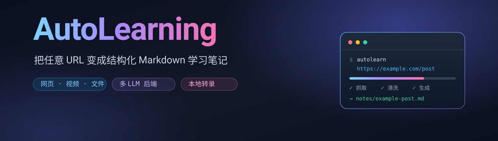
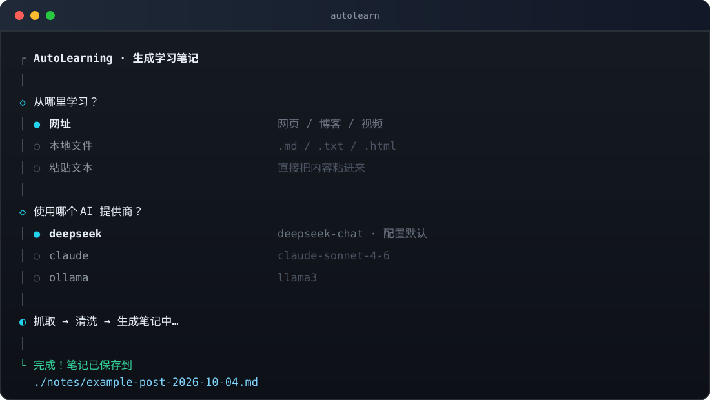
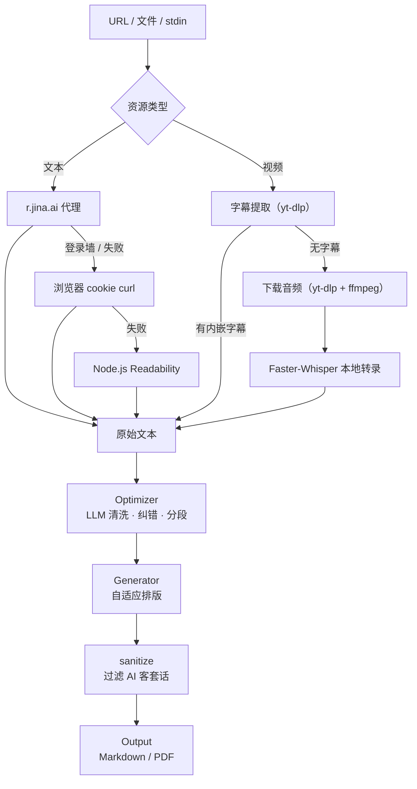
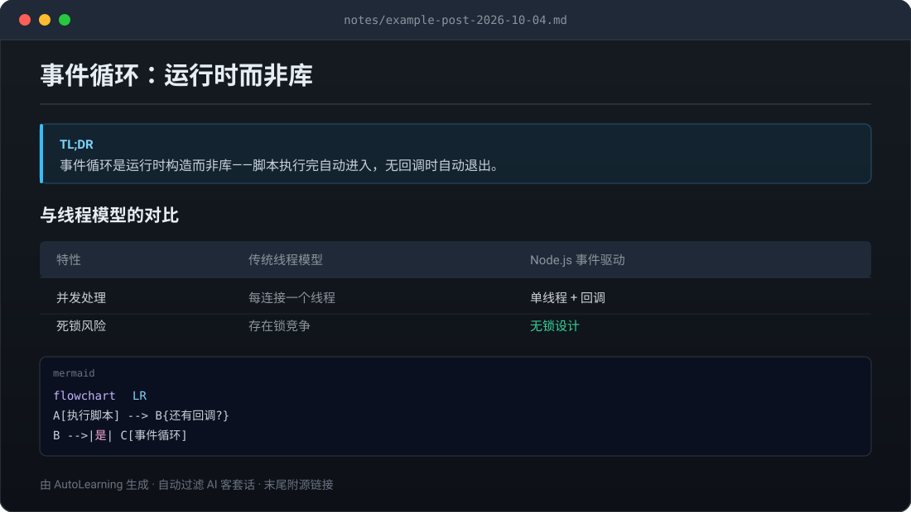

<div align="center">
  
</div>

<div align="center">
  <h3>把任意 URL 变成可复习的结构化 Markdown 笔记</h3>
  <p>网页 · 视频 · 本地文件 → TL;DR + 表格 + Mermaid 图 + LaTeX 公式</p>
</div>

<div align="center">
  
  
  
  
  
  
</div>

<br>

<div align="center">
  
</div>

<p align="center">
  <a href="#quickstart">快速开始</a> ·
  <a href="#features">功能</a> ·
  <a href="#wizard">交互式向导</a> ·
  <a href="#how">工作原理</a> ·
  <a href="#output">输出格式</a> ·
  <a href="#config">配置</a> ·
  <a href="#stack">技术栈</a>
</p>

---

## 🎯 它解决什么问题

收藏了一堆文章和视频，最后一条都没看。就算看了，两周后只记得"好像讲过什么"。

AutoLearning 把「收集」直接变成「可复习的笔记」：丢一个 URL 进去，拿回一份有 TL;DR、有对比表格、关键处配了图和公式的 Markdown——**它替你读完并整理好，你只负责复习**。

一个命令，不用打开浏览器、不用复制粘贴、不用再问一遍 AI：

```bash
autolearn https://nodejs.org/en/about
```

---

<a name="quickstart"></a>
## 🚀 快速开始

### 安装

```bash
git clone https://github.com/EasonWangyc/AutoLearning.git
cd AutoLearning
pnpm install      # 装依赖并自动构建到 dist/
npm link          # 注册全局 autolearn 命令
```

也可以直接从 GitHub 全局安装（`prepare` 脚本会自动完成构建）：

```bash
npm install -g github:EasonWangyc/AutoLearning
```

### 配置

```bash
autolearn config          # 交互式向导，第一次会从模板创建
```

或者手动创建 `~/.autolearning/config.toml`（见 [配置](#config)）。

### 跑起来

```bash
autolearn                                          # 🖥️ 交互式向导
autolearn https://nodejs.org/en/about              # 网页
autolearn -t video https://youtu.be/xxxx           # 视频
autolearn --format html https://nodejs.org/en/about # 顺便导出一份 HTML
pbpaste | autolearn --stdin --title "标题"          # 管道输入
```

### 前置依赖

**只有你想用的功能才需要装对应的依赖。**

| 工具 | 什么时候需要 | 安装 |
|------|-------------|------|
| yt-dlp + FFmpeg | 视频输入 | `pip install yt-dlp` / `apt install ffmpeg` |
| Python 3.10+ + faster-whisper | 视频**且**没有字幕 | `uv pip install faster-whisper` |
| pandoc + xelatex | `--format pdf` | `apt install pandoc texlive-xetex` |

> 纯文本 / 博客输入**零额外依赖**。

---

<a name="features"></a>
## ✨ 功能

| | 能力 | 说明 |
|---|------|------|
| 📄 | **文本三级降级抓取** | `r.jina.ai` 代理 → 浏览器 cookie `curl` → 本地 Readability，自动识别登录墙并降级 |
| 🎬 | **视频双路径** | 优先抽内嵌字幕（秒级）；无字幕时下载音频走本地 Faster-Whisper 转录（分钟级） |
| 🧹 | **LLM 内容清洗** | 去时间戳、纠 ASR 错字、去网页导航与广告、智能分段 |
| 🏷️ | **标题自动修正** | 识别 `来看看这段对话` / `New Chat` 这类无意义标题，按正文重写 |
| 🤖 | **四种 LLM 后端** | DeepSeek / Claude / OpenAI / Ollama，改一行配置就能换 |
| 📝 | **笔记自适应排版** | 概念用散文、对比用表格、流程用 Mermaid、公式用 LaTeX、访谈用引用 |
| 🌐 | **三种导出** | Markdown 原件 + HTML（浏览器直接看图看公式）+ PDF |
| 🧽 | **过滤 AI 客套话** | 自动剥掉 "希望这对你有帮助"、"Here is a summary…" 之类的开头结尾 |
| 🖥️ | **交互式向导** | 不想记参数就直接输 `autolearn`，在终端里选一选、填一填 |
| 🔁 | **URL 去重** | 处理过的链接记在 `history.json`，重跑要显式 `--force` |

---

<a name="wizard"></a>
## 🖥️ 交互式向导

记不住参数、或者只是懒得打字时，直接跑 `autolearn`。它会一步步问你：来源是什么、用哪个模型、存到哪、要不要读浏览器 cookie——全程方向键 + 回车。

```bash
autolearn              # 新建笔记向导（无参数时自动进入）
autolearn config       # 配置向导：改默认模型、API Key、输出目录、Whisper 大小
autolearn config --init    # 非交互：直接写一份模板配置
```

向导和命令行参数**完全等价**——所有 flag 原样保留，脚本和 CI 里的用法一点不受影响。非 TTY 环境（管道、CI）下 `autolearn` 不会傻等输入，而是照旧提示参数缺失。

> 💡 配置向导读写的是**原始 TOML**，`api_key = "${DEEPSEEK_API_KEY}"` 这样的环境变量占位符会被原样保留，不会被展开成明文密钥写回磁盘。

---

<a name="usage"></a>
## 📖 使用

### 文本（文档 / 博客 / 专栏）

```bash
autolearn https://nodejs.org/en/about                          # 普通网站
autolearn https://www.bilibili.com/opus/1042547317663596551    # Bilibili 专栏
autolearn --cookies-from-browser firefox "https://zhuanlan.zhihu.com/p/xxx"  # 知乎（需登录）
autolearn --file article.md                                    # 本地文件
cat article.md | autolearn --stdin --title "标题"               # 标准输入
```

### 视频（YouTube / Bilibili）

```bash
autolearn -t video https://www.youtube.com/watch?v=xxx
autolearn -t video --cookies-from-browser firefox "https://www.bilibili.com/video/BVxxx"
autolearn https://www.youtube.com/watch?v=xxx                  # auto 自动识别
```

Bilibili 没带 cookie 会返回 412，此时会提示你加 `--cookies-from-browser`。

### 通用选项

```bash
autolearn -p claude URL          # 指定 LLM 后端
autolearn -o ./my-notes URL      # 指定输出目录
autolearn --format html URL      # 导出 HTML（推荐，看图看公式都正常）
autolearn --format pdf URL       # 导出 PDF
autolearn --force URL            # 忽略历史记录，强制重跑
autolearn -v URL                 # 出错时打印堆栈
autolearn --help                 # 完整帮助
```

---

<a name="output"></a>
## 📤 输出格式

笔记**永远会存一份 Markdown**；`html` 和 `pdf` 是在它旁边额外导出的文件。

```bash
autolearn URL                    # notes/标题-日期.md
autolearn --format html URL      # ↑ 外加 notes/标题-日期.html
autolearn --format pdf URL       # ↑ 外加 notes/标题-日期.pdf
```

### HTML

单文件，双击就能用浏览器打开：

- **Mermaid 图直接渲染** —— 不用再对着代码块脑补流程图
- **LaTeX 公式正常显示** —— `$O(n \log n)$` 就是公式，不是一堆美元符号
- **自动适配浅色 / 深色** —— 跟随系统主题切换
- **宽表格横向滚动** —— 不会把页面撑破
- **打印友好** —— `Cmd/Ctrl + P` 直接出干净的 PDF

Mermaid 和 KaTeX 从 CDN 加载，所以 HTML 本身只有几十 KB。**断网时会优雅降级**：图退化成代码块原文、公式退化成 `$...$`，内容一个字都不会丢。

> ⚠️ 笔记正文里的原始 HTML 会被转义。笔记是从任意网页总结来的，转义能防止被注入的 `<script>` 在你打开或转发这个文件时执行。

### PDF

走 pandoc + xelatex，需要额外安装 TeX 发行版（见[前置依赖](#quickstart)）。中文字体走 DejaVu，复杂排版可能需要自己调模板。

---

<a name="how"></a>
## 🔍 工作原理



- **文本三级抓取**：`r.jina.ai` 代理（主）→ 浏览器 cookie `curl`（登录站点）→ 本地 Readability（兜底）。每一级都会检测登录墙/验证码，命中就降级。
- **视频双路径**：先试内嵌字幕（秒级）；没有就下载音频交给本地 Faster-Whisper（分钟级）。VTT 的滚动式重复字幕会去重。
- **先清洗再生成**：所有文本先经一遍 LLM——去掉时间戳、修正语音识别错字、剔除网页导航和广告、重新分段——再交给生成器。这一步显著提升长视频笔记的质量。
- **笔记风格**：TL;DR 开篇 → 按内容形态自选排版 → 3-5 条「关键洞察」收尾，末尾附源链接。

### 📝 生成的笔记长什么样

<div align="center">
  
</div>

---

<a name="config"></a>
## ⚙️ 配置

配置文件在 `~/.autolearning/config.toml`，`${VAR}` 会自动展开为环境变量。

```toml
[provider]
default = "deepseek"

[providers.deepseek]
api_key = "${DEEPSEEK_API_KEY}"
model = "deepseek-chat"
base_url = "https://api.deepseek.com/v1"

[providers.claude]
api_key = "${ANTHROPIC_API_KEY}"
model = "claude-sonnet-4-6-20250501"

[providers.openai]
api_key = "${OPENAI_API_KEY}"
model = "gpt-4o"

[providers.ollama]
base_url = "http://localhost:11434"
model = "llama3"

[output]
directory = "./notes"
filename_template = "{title}-{date}.md"

[local_whisper]
python_path = "/path/to/venv/bin/python3"
model_size = "base"          # tiny | base | small | medium | large
```

改配置有两种方式：`autolearn config` 交互式修改，或直接编辑文件。`ollama` 不需要 `api_key`——配了 `base_url` 就会走本地。

---

<a name="stack"></a>
## 🧱 技术栈

| 层 | 选型 |
|----|------|
| 语言 / 构建 | TypeScript 5.9 · tsup · tsx |
| 运行时 | Node.js ≥ 20.12 |
| CLI 框架 | Commander 13 |
| 交互式 TUI | [@clack/prompts](https://github.com/bombshell-dev/clack) |
| 网页解析 | Mozilla Readability · JSDOM · Turndown |
| 笔记渲染 | marked（Markdown → HTML）· Mermaid / KaTeX（CDN，按需加载） |
| 配置 | smol-toml（TOML + `${ENV}` 展开） |
| LLM | Anthropic SDK · OpenAI SDK（兼容 DeepSeek）· Ollama HTTP API |
| 语音转写 | faster-whisper（Python，本地 CPU int8） |
| 测试 | Vitest |
| PDF 导出 | pandoc + xelatex |

---

<a name="structure"></a>
## 📁 项目结构

<details>
<summary>展开查看</summary>

```
src/
├── cli.ts                    # Commander 参数解析 + 子命令路由
├── pipeline.ts               # 串联所有模块，两个入口：URL / 纯文本
├── config.ts                 # TOML 读写（loadConfig 展开 ENV，loadRawConfig 不展开）
├── history.ts                # URL → 笔记 的去重记录
├── progress.ts               # Progress 接缝：stderr / TUI spinner / 静默三种实现
├── types.ts
├── fetcher/                  # URL → 文本（策略模式）
│   ├── index.ts              #   getFetcher 路由：auto 按 URL 特征选
│   ├── text-fetcher.ts       #   r.jina.ai → cookie curl → Readability
│   └── video-fetcher.ts      #   yt-dlp 字幕 → 音频 → Whisper
├── parser/                   # HTML 清洗、文本规范化
├── optimizer/                # LLM 清洗正文 + 修正无意义标题
├── generator/                # 文本 → 笔记（策略模式）
│   ├── index.ts              #   getGenerator 路由
│   ├── prompt.ts             #   三个后端共用的 system prompt（单一来源）
│   ├── claude.ts             #   Anthropic SDK
│   ├── openai.ts             #   OpenAI SDK（DeepSeek 复用）
│   └── ollama.ts             #   本地 Ollama
├── transcriber/              # 语音转文字
│   ├── local-whisper.ts      #   faster-whisper（已接入 pipeline）
│   ├── whisper.ts            #   OpenAI Whisper API（已实现，未接入）
│   └── alibaba.ts            #   阿里云（已实现，未接入）
├── output/                   # 写出 + 导出
│   ├── index.ts              #   文件名模板、非法字符处理
│   ├── sanitize.ts           #   过滤 AI 客套话 + 修复畸形代码围栏
│   ├── format.ts             #   md / html / pdf 的取值校验与路径推导
│   ├── html.ts               #   Markdown → 单文件 HTML（Mermaid / KaTeX / 深浅色）
│   ├── html-styles.ts        #   HTML 内联样式
│   └── convert.ts            #   Markdown → PDF（pandoc）
└── tui/                      # 交互式向导
    ├── index.ts              #   TTY 检测 + 统一出口
    ├── wizard.ts             #   新建笔记向导
    ├── config-wizard.ts      #   配置编辑器
    ├── choices.ts            #   纯函数：URL 校验、提供商列表、密钥脱敏
    └── progress.ts           #   clack 进度条实现
```

</details>

---

<a name="roadmap"></a>
## 🗺️ Roadmap

- [x] 文本三级抓取 + 登录墙降级
- [x] 视频字幕 / 本地 Whisper 双路径
- [x] 多 LLM 后端
- [x] 交互式向导 + 配置编辑器
- [x] HTML 导出（Mermaid / LaTeX / 深浅色自适应）
- [ ] 自带目录（TOC）与锚点跳转
- [ ] `--format html --offline`：把 Mermaid / KaTeX 内联进文件，断网也能看图
- [ ] 笔记库检索与回看（`autolearn list` / `search`）
- [ ] Obsidian / Notion 导出
- [ ] 同一 URL 的增量更新（源文有更新时只补差异）
- [ ] 接入 OpenAI Whisper API / 阿里云转写（实现已存在，未接进 pipeline）

---

<a name="limits"></a>
## ⚠️ 已知限制

- **不做 OCR**：图片里的文字提不出来，扫描版 PDF 无效。
- **不做 DRM 视频**：只处理 yt-dlp 能拿到字幕或音频的站点。
- **不做实时**：一次性处理，没有流式输出。
- **转写后端只接了本地 Whisper**：`whisper.ts` / `alibaba.ts` 已实现但没接进 pipeline，配了也不会生效。
- **PDF 导出依赖 TeX 发行版**：中文字体走 DejaVu，复杂排版可能需要自己调模板。
- **HTML 的图与公式需要联网**：Mermaid / KaTeX 走 CDN，离线时降级为原文（内容不丢，只是不好看）。
- **HTML 没有目录**：长笔记只能靠浏览器搜索定位。

---

<a name="license"></a>
## 📄 License

[Apache-2.0](LICENSE) © 2026 EasonWangyc

可自由使用、修改、分发（含商用）；需保留版权声明与许可证副本。
